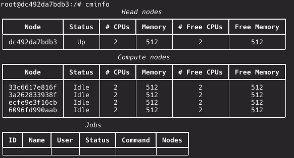

# CS630 - Distributed Systems
 
## Minimal cluster manager and job scheduler
Implements a cluster and workload management system in (primarily) Python with minimal dependencies.
Set up to run in docker containers.


### Requirements
Docker, `docker-compose`.

Optional: GNU Make

Also optional: `requirements.txt` -- mostly just linting tools used in `make quality` and `make style`.
Are not called from other `make` commands.

Windows Warning: this has only been tested on Unix-based OSes.

### Overview
Directory breakdown:

* `cm/` holds most of the cluster manager (CM) software.
* `drive/` holds directories/files that will be mounted to all containers (shared files and file systems). 
  * `home`: persistent and shared `/home` directory
  * `db`: persistent data storage (mongodb). Note: Makefile is set up to clean it out every time.
  * `etc`: holds `passwd` and `groups`; was supposed to help manage users across nodes, but SELinux prevents it, and I haven't
  had time to resolve it. So for now it won't be mounted, but I figured I'd keep it.
* `computenode/`: Compute node docker image (Dockerfile)
* `headnode/`: Compute node docker image (Dockerfile)

There's a docker compose file as well that sets up the docker environment (`docker-compose.yml`).
If started without arguments (`docker compose up`) it will start exactly one head node container and one compute node.

However the default target in `Makefile` is setting it up with multiple compute nodes to make it a more realistic scenario.

### Running
Simply do:

```
make
```

### Accessing interface
You can access CM commands by ''ssh-ing'' into the head node, which in this case is just starting an interactive terminal in the
head node container:

```
make exec-head
```

Once you're in the head node bash, you can try the following commands:

#### Get node, resource and job information
```
cminfo
```



#### Start a job
```
cmrun -n $NUM_NODES -p $NUM_CLONES_PER_NODE $COMMAND
```

<p style="color: red"><b>WARNING:</b></p>
Nodes dump stdout and stderr from your jobs into a directory named `cmlogs/`, and that directory will be in your working
directory (wherever you `cmrun` from.)
Because of this, please make sure to run your jobs from a home directory, otherwise your logs will be stored in each container
separately and you probably don't want that.

By default, `make exec-head` will put you in `/home/$USER`, so as long as you don't change directory inside, you should be fine.

There's more arguments associated with `cmrun`, so check out `cmrun --help` for that.

Once you start a job, you should see the job id assigned to it printed out. 
It should be a nonnegative integer.

#### Stop/kill a job
```
cmkill $JOB_ID
```

### CM Software
Under `cm/` you will find `bin/`, which symlinks to interfaces, and is itself in the system path.

`etc/` holds the configuration files (file really).
This is where settings like job defaults, timeout values, retries, and the like are specified.

Finally, last but not least, `cman/` holds the actual software.

Every node runs `cmdaemon` to stay alive. 
The daemon is responsible for receiving and handling messages, and coordinating everything with the head node (unless it's the
head node itself.)

Scripts, functions, and routines specific to compute nodes are in `cman/src/compute`, those specific to head nodes are in
`cman/src/master`.
For compute nodes this is just the message handler, and subprocesses that the daemon will run (messaging, scheduling, purging.)

Head nodes however are more complicated, because 1. they have a data storage (mongodb), and data schemas associated with it
(mongoengnine), along with a longer set of actions they need to handle in their message handler.
The daemon will run two subprocesses here: messaging and scheduling.

The scheduling that takes place on the head node is job-level; meaning it tries to assign jobs to nodes, without the nodes
knowing details about the job; they just self report their available resources. Once a job scheduling is successful, the head
node will send the job and its details down to individual nodes, at which time the messaging service at the compute node
receives and queues the job. The scheduling service on the compute node is responsible for taking those jobs and actually
running them.
The purging service only exists on compute nodes, which is responsible for periodically checking whether jobs have gone over
time or died / finished, and reporting that back to head node.

More details will be presented in the written report.


## Author
[Ali Hassani](https://alihassanijr.com)
